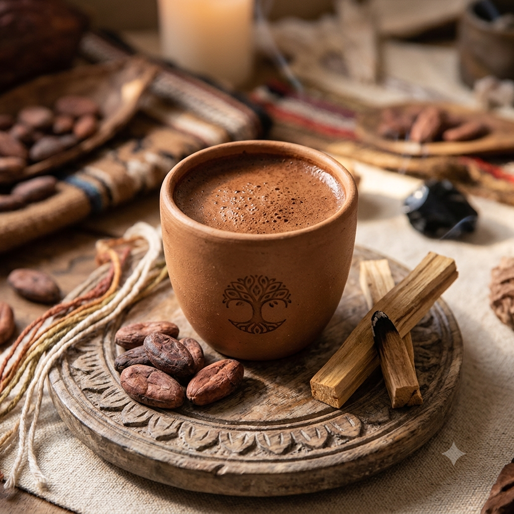

---
title: "El Cacao, Espíritu del Corazón"
toc: false
---

*"El cacao no es solo una bebida, es un puente hacia el corazón."*

---

## 🌿 Un alimento sagrado

El cacao es mucho más que un alimento: es un **maestro vegetal** que abre el corazón, despierta los sentidos y nos conecta con nuestra esencia más profunda. Su uso ceremonial se remonta a miles de años, y hoy sigue siendo una herramienta poderosa para la introspección, la sanación y la conexión comunitaria.

---

## 🌎 Origen ancestral

Cultivado por las culturas **mayas y aztecas**, el cacao era considerado un regalo de los dioses. Su nombre científico, *Theobroma cacao*, significa precisamente *"alimento de los dioses"*.

- Los mayas lo utilizaban en ceremonias sagradas para honrar a sus deidades.
- Los aztecas lo valoraban tanto que llegó a ser utilizado como moneda de intercambio.
- Era consumido por guerreros y sacerdotes para obtener fuerza y claridad.

Hoy, ese legado vive en cada taza que preparamos con intención y gratitud.

---

## ✨ Propiedades del cacao

El cacao ceremonial es rico en nutrientes que benefician cuerpo, mente y espíritu:

| Propiedad | Beneficio |
| :--- | :--- |
| **Teobromina** | Estimulante suave que activa la circulación y eleva el ánimo. |
| **Magnesio** | Relaja el sistema nervioso y favorece la conexión interior. |
| **Antioxidantes** | Protegen las células y combaten el estrés oxidativo. |
| **Feniletilamina (PEA)** | Conocida como la "molécula del amor", genera sensación de bienestar. |

> El cacao ceremonial nos invita a **bajar el ritmo**, a escuchar el latido del corazón y a abrir espacios de diálogo sincero con nosotros mismos y con los demás.

---

## 🍫 Uso ceremonial

En nuestras ceremonias, el cacao se prepara con respeto y atención. Cada paso es una ofrenda.

**Ingredientes básicos:**

- Cacao ceremonial puro (pasta o granos molidos).
- Agua caliente o leche vegetal.
- Endulzante natural: miel, panela o jarabe de agave.
- Opcional: especias como canela, vainilla o pimienta.

**Preparación con intención:**

1. Calienta el agua sin que hierva.
2. Disuelve el cacao mientras sostienes una intención en tu corazón.
3. Endulza al gusto y sirve en una taza bonita.
4. Antes de beber, tómate un momento para agradecer.

> 💚 *"Cada sorbo es un recordatorio de que la sabiduría y el amor habitan en nosotros."*

---

## 🤲 Nuestro compromiso

En **Corazón de Loto**, trabajamos exclusivamente con **cacao de comercio justo**, cosechado de manera sostenible y con respeto por la tierra y las comunidades que lo cultivan.

Creemos que la calidad del cacao y la pureza de la intención son inseparables. Por eso, cada ceremonia es también un acto de gratitud hacia la naturaleza y hacia quienes hacen posible este sagrado encuentro.

---

## 🧘‍♀️ Te invitamos a probar

Si sientes la llamada del cacao, te animamos a preparar tu propia ceremonia en casa. No necesitas nada especial, solo:

- Un espacio tranquilo.
- Una taza de cacao preparado con amor.
- Un corazón dispuesto a abrirse.

---

  <em>“El cacao es el latido de la tierra en tu corazón.”</em>

---

<!-- Botón flotante fijo -->
<a href="https://forms.gle/P6Cn2inD8nXNLa4dA" class="floating-btn" target="_blank">
  Contáctanos
</a>

  
  
Una taza de cacao preparada con intención

