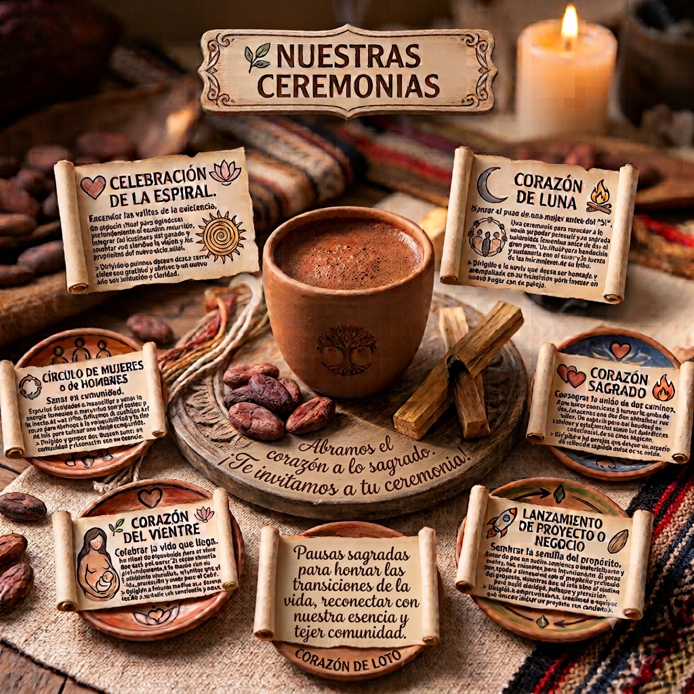

*"Cada ceremonia es un puente entre el corazón y el misterio de la vida."*

---

## 🌸 El arte de pausar y celebrar

Las ceremonias son **pausas sagradas** para honrar las transiciones de la vida, reconectar con nuestra esencia y tejer comunidad. A través de la medicina del cacao y la guía del loto, abrimos espacio para la transformación, la claridad y la sanación.

En **Corazón de Loto**, cada ceremonia es única y se diseña con intención, respeto y profundo amor por quienes participan.

---

## 🌿 Nuestras Ceremonias

### 🔥 Celebración de la Espiral
*Encender las velitas de la existencia.*

Un espacio ritual para **agradecer profundamente el camino recorrido**, integrar las lecciones del pasado y sembrar con claridad la visión y los propósitos del nuevo ciclo solar.

> Diridido a  quienes desean desea cerrar ciclos con gratitud y abrirse a un nuevo año con intención y claridad.

---

### 🌙 Corazón de Luna
*Honrar el paso de una mujer antes del "Sí".*

Una ceremonia para recordar a la novia su poder personal y su sagrada naturaleza femenina antes de dar el gran paso. Un ritual para bendecirla y sostenerla con el amor y la fuerza de las mil mujeres de su tribu.

> Dirigido a la novia que desea ser honrada y acompañada en su transición para formar un nuevo hogar con su pareja.

---

### ❤️‍🔥 Corazón Sagrado
*Consagrar la unión de dos caminos.*

Para hacer consciente y honrar la unión de dos corazones que deciden entrelazar sus vidas. Un espacio para **bendecir su caminar** y establecerlos como los guardianes conscientes de su amor sagrado. 

> Dirigido a las parejas que desean un espacio de reflexión sagrada antes de su unión. 

---

### 🔄 Círculo de Mujeres o de Hombres
*Sanar en comunidad.*

Espacios dedicados a **reconciliar y sanar la energía femenina o masculina** con el sostén y la fuerza de una tribu. Utilizamos la medicina del cacao para abrirnos a la vulnerabilidad y la flor de loto para enfocar una visión compartida.

> Dirigido a grupos que buscan sanar en comunidad y reconectar con su esencia.

---

### 🌱 Corazón del Vientre
*Celebrar la vida que llega.*

Un ritual de bienvenida para el alma que está por nacer. El cacao conecta profundamente a la madre con su **intuición y sabiduría mamífera**, mientras que el loto crea un espacio energético de luz, protección y amor para el bebé.

> Dirigido a Futuras madres que desean recibir a su bebé con conciencia y amor.

---

### 🚀 Lanzamiento de Proyecto o Negocio
*Sembrar la semilla del propósito.*

Antes de que un sueño comience a materializarse y crecer, nos reunimos para **intencionarlo**. El cacao nos ayuda a alinearnos con el propósito profundo del proyecto, mientras que el loto abre el camino para pedir claridad, enfoque y protección.

> Dirigido a emprendedores, creadores o equipos que desean iniciar un proyecto con conciencia.

---

## ✨ ¿Qué ofrecemos en cada ceremonia?

| Elemento | Descripción |
| :--- | :--- |
| **Cacao ceremonial** | Bebida sagrada que abre el corazón y facilita la conexión interior. |
| **Flor de Loto** | Símbolo de pureza, transformación y luz; guía el espacio energético. |
| **Música y cantos** | Sonidos que elevan la vibración y acompañan el viaje. |
| **Espacio de palabra** | Compartir en círculo con confianza y escucha profunda. |
| **Ritual personalizado** | Adaptado a la intención y las necesidades de cada persona o grupo. |

---

## 📿 Nuestro compromiso

Cada ceremonia es un **acto de amor y respeto** hacia quienes participan, hacia la tradición y hacia la tierra. Nos comprometemos a:

- Crear espacios seguros y acogedores.
- Utilizar ingredientes de comercio justo y origen consciente.
- Honrar la sabiduría ancestral sin apropiación ni comercialización.
- Acompañar cada proceso con confidencialidad y calidez.

---

## 🌸 ¿Te gustaría vivir una ceremonia?

Si sientes que alguna de estas ceremonias resuena contigo, o si deseas crear una experiencia personalizada, escríbenos. Estaremos encantados de acompañarte.

---

  <em>“La sabiduría ya habita en tu interior; estos espacios solo están aquí para recordarte el camino de vuelta a casa.”</em>

---

  
  
Un círculo de corazones abiertos, guiados por el cacao y la intención

---

  ✦ ✦ ✦

