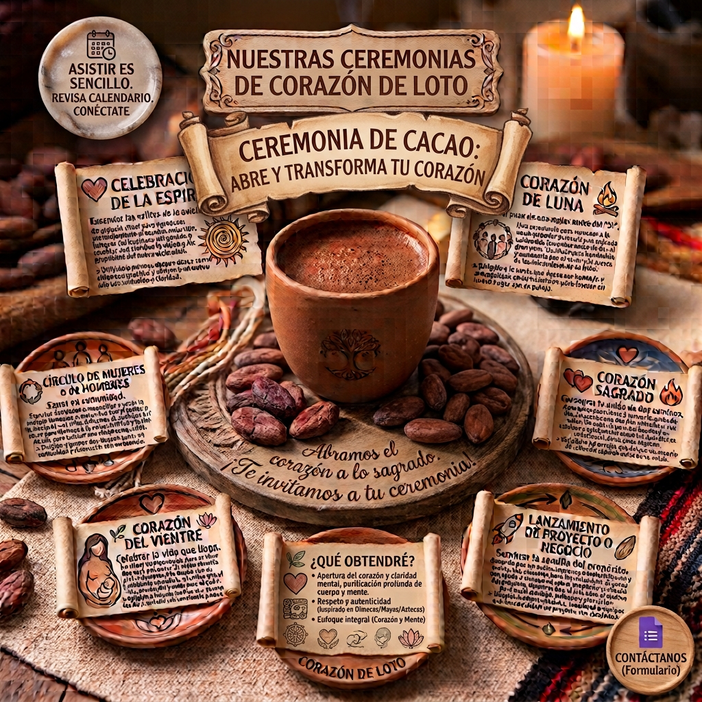

---

En Corazón de Loto honramos la sabiduría ancestral de México a través de ceremonias de cacao, un ritual que tiene sus raíces en las antiguas culturas de Mesoamérica, donde el cacao era considerado un regalo divino y una bebida sagrada. En nuestras ceremonias, el cacao se convierte en un puente para abrir el corazón y conectar con la esencia de cada persona.

Complementamos esta tradición con la práctica de mantras budistas, cuyo propósito es purificar los velos que oscurecen la transformación y la sabiduría inata en todos los seres. Cada sílaba de las mantras actúa como un sonido sagrado que disuelve bloqueos y limpia la mente. La la fuerza medicinal del cacao abre el corazón y la sabiduría de los mantras budistas, crea un espacio interior para la sanación emocional y la transformación espiritual

---

### ¿Qué obtendré?

Al asistir a una ceremonia de Corazón de Loto, experimentarás:

Apertura del corazón y claridad mental: El cacao contiene teobromina, un vasodilatador natural que estimula la circulación sanguínea, ayudando a abrir el corazón y facilitando un estado de mayor claridad y conexión emocional.

Purificación profunda: Los mantras budistas que recitamos están diseñados para eliminar el karma negativo y los velos que bloquean tu progreso espiritual. Cada sonido trabaja para purificar el cuerpo, el habla y la mente.

Transformación interior: La combinación del cacao y los mantras crea un terreno fértil para la introspección, permitiéndote soltar lo que ya no te sirve y abrirte a una nueva sabiduría.

Un espacio de conexión: Vivirás una experiencia guiada en un entorno seguro y respetuoso, donde la música, los cantos y la meditación te acompañarán en un viaje hacia tu interior.

---

### ¿Por qué es diferente?

Corazón de Loto no es una ceremonia más. Nuestra diferencia radica en:

La fusión de dos tradiciones sagradas: Mientras muchas ceremonias se enfocan solo en el cacao o solo en la meditación, nosotros integramos de manera orgánica la tradición del cacao del México antiguo con la práctica de mantras del budismo. Esta síntesis ofrece un camino de sanación que abarca tanto el corazón (con el cacao) como la mente (con los mantras).

Respeto y autenticidad: Nos inspiramos en las tradiciones originales de culturas como la olmeca, maya y azteca, donde el cacao era un elemento central en rituales de salud, prosperidad y crecimiento espiritual. Nuestro enfoque es consciente y respetuoso, evitando la apropiación cultural y buscando honrar la esencia de estas enseñanzas.

Un enfoque integral: No solo trabajamos con el cuerpo o la mente, sino con la totalidad de tu ser. La ceremonia está diseñada para que puedas abrir el corazón, purificar tu mente y despertar tu sabiduría interior en una sola experiencia.

---

### ¿Cómo puedo asistir a las ceremonias públicas?

Asistir a una ceremonia de Corazón de Loto es sencillo:

Revisa nuestro calendario: Visita la sección "Próximas Ceremonias" en nuestra pagina de web para conocer las fechas disponibles.

Conéctate con nosotros: Si tienes dudas, puedes escribirnos a través del formulario de contacto. Estaremos encantados de acompañarte en este proceso.

---

### ¿Puedo solicitar una ceremonia personal?

Si. Elige tu experiencia: Además de las ceremonias públicas ofrecemos diferentes tipos de ceremonias  Elige la que mejor se adapte a ti. 

Inscríbete: Completa el formulario de registro con tus datos activando el botón de Contáctanos. Te enviaremos toda la información que necesitas para prepararte (qué llevar, recomendaciones, etc.).

<!-- Botón flotante fijo -->
<a href="https://forms.gle/P6Cn2inD8nXNLa4dA" class="floating-btn" target="_blank">
  Contáctanos
</a>

---

